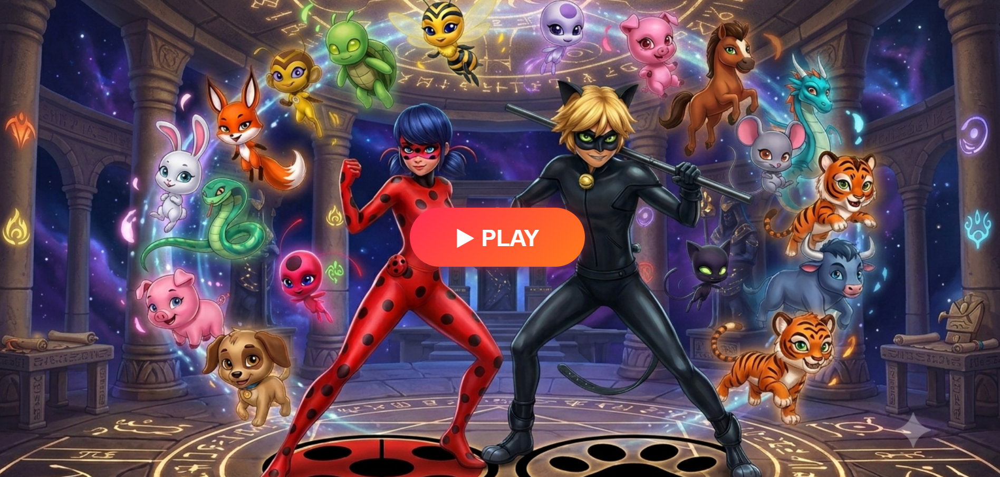
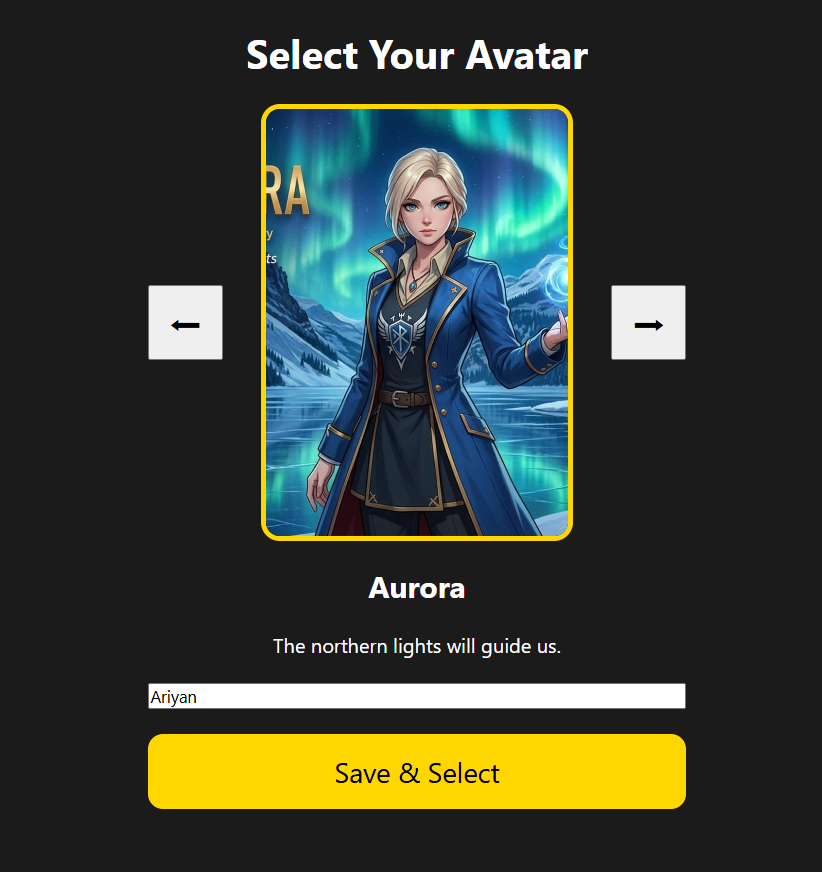
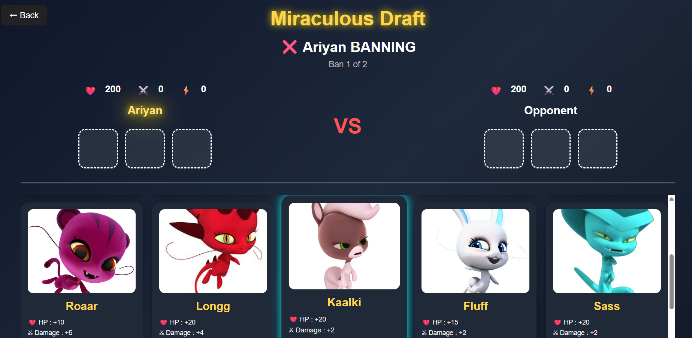
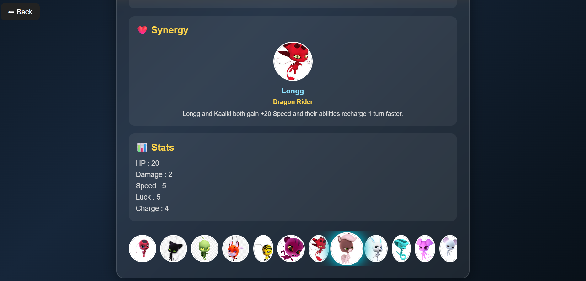
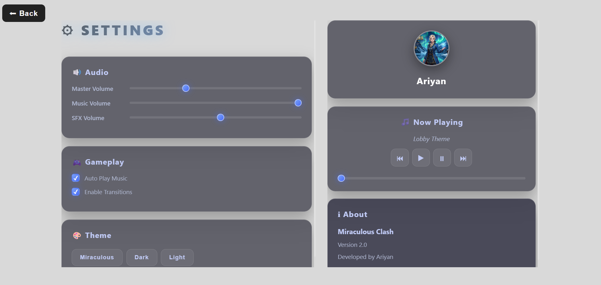

# 🐞 Miraculous Clash (V1)

A turn-based strategy battle game inspired by the Miraculous universe.

Players build a team of five Kwamis, each with unique stats, active abilities, passive abilities, and powerful synergies. Every battle requires planning, timing, and strategy rather than luck alone.

> **Current Version:** v1.1 (Core Gameplay Complete)

---

# 🎮 Features

## ⚔️ Turn-Based Combat

* Normal attacks
* Ability-based combat
* Cooldown system
* Speed determines the first turn
* Extra turns
* Double attacks

---

## 🐾 18 Playable Kwamis

Each Kwami has:

* HP
* Damage
* Speed
* Active Ability
* Passive Ability
* Cooldown

Current roster:

* Tikki
* Plagg
* Wayz
* Trixx
* Pollen
* Roaar
* Longg
* Kaalki
* Fluff
* Sass
* Daizzi
* Mullo
* Nooroo
* Orikko
* Stompp
* Tussoo
* Xuppu
* Ziggy

---

# ✨ Battle Mechanics

Implemented mechanics include:

* Healing
* True Damage
* Shields
* Shield Break
* Damage Buff
* Damage Reduction
* Regeneration
* Dodge
* Immunity
* Freeze
* Stun
* Passive Abilities
* Ability Boost
* Floating Damage Numbers
* Battle Log
* Health Bars
* Cooldown Reduction

---

# 🤝 Team Synergies

Special combinations unlock unique effects.

Current synergies include:

* 🐞 Creation & Destruction
* 🐉 Dragon Rider
* 🎭 Chaos Illusion
* 🛡 Guardian
* ⏳ Time Loop

More synergies are planned for future versions.

---

# 📸 Screenshots

## 🏠 Home Screen

---

## 🦸 Avatar Selection

---

## 🎮 Lobby

---

## 🃏 Kwami Draft

---

## 🃏 Kwami Draft

---

## 🃏 Kwami Draft

---

## ⚔️ Battle

---

## 🏆 Victory Screen

---

## ⚙️ Settings

---

# 🚧 Planned Features (Version 2)

* Avatar Selection
* Username Selection
* VS Screen
* Victory Screen
* Defeat Screen
* Improved Draft UI
* Better Battle Animations
* Sound Effects
* Background Music
* Improved Visual Effects

---

# 🌟 Future Plans

* More Kwamis
* More Synergies
* Ranked Battles
* AI Opponent
* Story Mode
* Achievement System
* Battle Statistics
* Save Progress
* Online Multiplayer (Long-term goal)
* Mobile-friendly Interface

---

# ⚠️ Known Limitations

Current version is focused on gameplay.

Still missing:

* Sound effects
* Music
* Avatar customization
* Username system
* Save files
* AI opponents
* Multiplayer
* Polish animations

These will be added gradually.

---

# 🛠 Built With

* HTML5
* CSS3
* JavaScript (Vanilla)

No external frameworks are currently used.

---

# 📈 Project Status

**Version:** v1.1

✅ Core gameplay complete

The combat engine, abilities, passive effects, synergies, cooldown system, and battle mechanics are stable after multiple test matches.

Future updates will mainly focus on improving presentation, user experience, and adding new content.

---

# 👨‍💻 Developer

Created by **SK Ariyan**

This project is a personal learning journey to improve skills in JavaScript, game logic, UI design, and software development while building a complete strategy game from scratch.

---

# ⭐ Support

If you like this project, consider giving it a ⭐ on GitHub.

Feedback, suggestions, and bug reports are always welcome.
